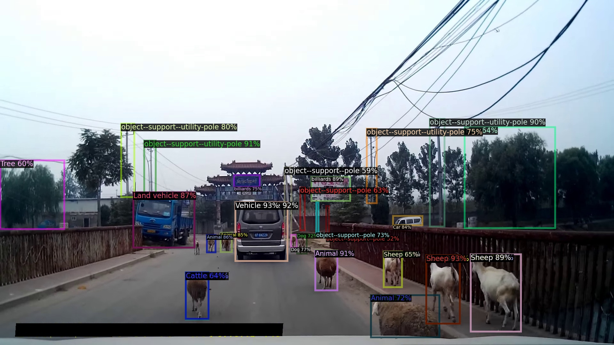

# Simple multi-dataset detection
An object detector trained on multiple large-scale datasets with a unified label space; Winning solution of ECCV 2020 Robust Vision Challenges.

  

> [**Simple multi-dataset detection**](http://arxiv.org/abs/2102.13086),            
> Xingyi Zhou, Vladlen Koltun, Philipp Kr&auml;henb&uuml;hl,        
> *CVPR 2022 ([arXiv 2102.13086](http://arxiv.org/abs/2102.13086))*         

Contact: [zhouxy@cs.utexas.edu](mailto:zhouxy@cs.utexas.edu). Any questions or discussions are welcomed! 

## Features at a glance

- We trained a unified object detector on 4 large-scale detection datasets: COCO, Objects365, OpenImages, and Mapillary, with state-of-the-art performance on all of them.

- The model predicts class labels in a **learned** unified label space.

- The model can be directly used to test on novel datasets outside the training datasets.

- In this repo, we also provide state-of-the-art baselines for Objects365 and OpenImages.

## Main results

- [RVC challenge](http://www.robustvision.net/leaderboard.php?benchmark=object)

| COCO test-challenge | OpenImages public test | Mapillary test | Objects365 val |
|---------------------|------------------------|----------------|----------------|
| 52.9                | 60.6                   | 25.3           | 33.7           |

Results are obtained using a Cascade-RCNN with ResNeSt200 trained in an 8x schedule.

- Unified model vs. ensemble of dataset-specific models with known test domains.

|                       |  COCO     | Objects365   |  OpenImages  |  mean. |
|-----------------------|-----------|--------------|--------------|--------|
|Unified                | 45.4      | 24.4         | 66.0         | 45.3   |
|Dataset-specific models| 42.5      | 24.9         | 65.7         | 44.4   |

Results are obtained using a Cascade-RCNN with Res50 trained in an 8x schedule.

- Zero-shot cross dataset evaluation

|                |  VOC  | VIPER |  CityScapes  | ScanNet | WildDash | CrowdHuman | KITTI | mean |
|----------------|-------|-------|--------------|---------|----------|------------|-------|------|
|Unified         | 82.9  | 21.3  | 52.6         | 29.8    | 34.7     | 70.7       | 39.9  | 47.3 |
|Oracle models   | 80.3  | 31.8  | 54.6         | 44.7    | -        | 80.0       | -     | -    |

Results are obtained using a Cascade-RCNN with Res50 trained in an 8x schedule.

More models can be found in our [MODEL ZOO](docs/REPRODUCE.md).

## Installation

Our project is developed on [detectron2](https://github.com/facebookresearch/detectron2). Please follow the official [detectron2 installation](https://github.com/facebookresearch/detectron2/blob/master/INSTALL.md).

## Demo

We use the same inference API as detectorn2. To run inference on an image folder using our pretrained model, run

~~~
python demo.py --config-file configs/Unified_learned_OCIM_R50_6x+2x.yaml --input images/*.jpg --opts MODEL.WEIGHTS models/Unified_learned_OCIM_R50_6x+2x.pth
~~~

If setup correctly, the output should look like:

  

*The sample image is from [WildDash](https://wilddash.cc/) dataset.

Note that the model predicts all labels in its label hierarchy tree (for example, both `vehicle` and `car` for a car), following the protocol in OpenImages.

## Benchmark evaluation and training

After installation, follow the instructions in [DATASETS.md](docs/DATASETS.md) to setup the (many) datasets. Then check [REPRODUCE.md](docs/REPRODUCE.md) to reproduce the results in the paper.

## License

Our code is under [Apache 2.0 license](LICENSE).

## Citation

If you find this project useful for your research, please use the following BibTeX entry.

    @inproceedings{zhou2021simple,
      title={Simple multi-dataset detection},
      author={Zhou, Xingyi and Koltun, Vladlen and Kr{\"a}henb{\"u}hl, Philipp},
      booktitle={CVPR},
      year={2022}
    }